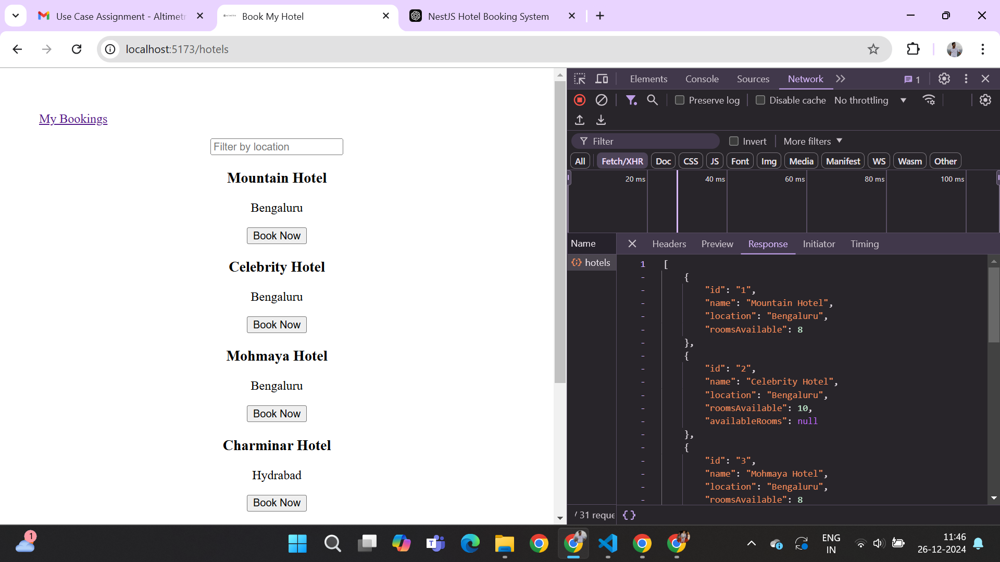
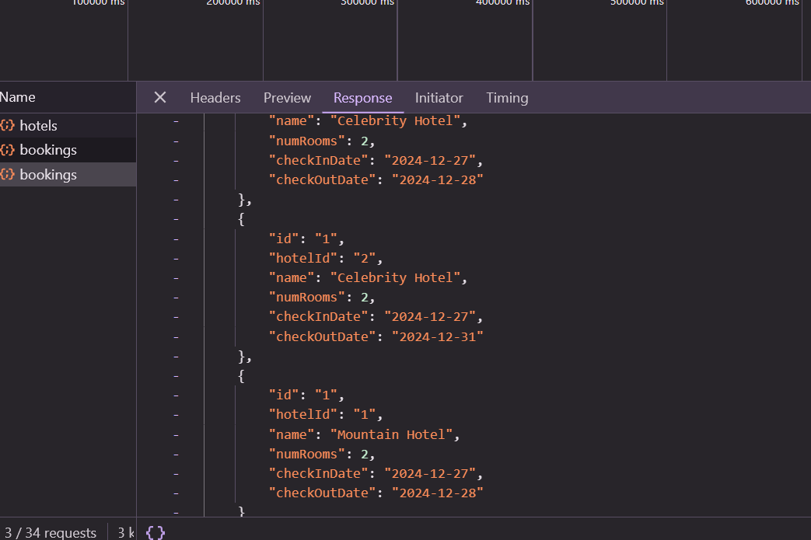
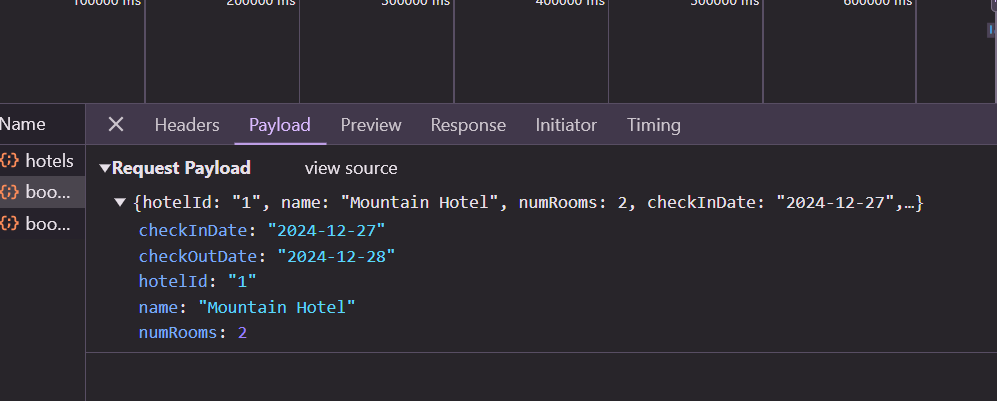
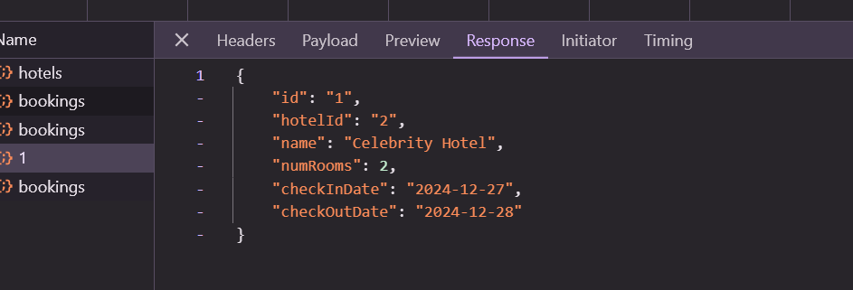
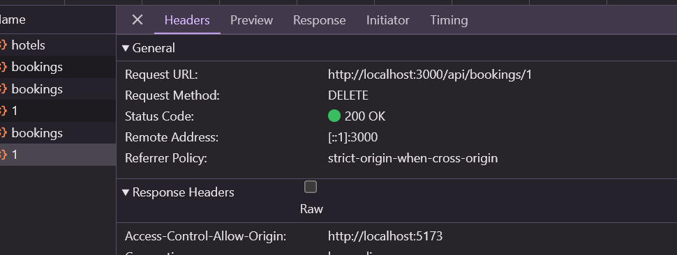

#Steps to use
1. npm i
2. npm start // it will run on 3000 port
3. Cors is enabled for 'http://localhost:5173', Please update in main.ts if your client is running on different address

API Documentation for endpoints

Base URL: http://localhost:3000/api

1. Get All Hotels

GET /hotels
GET /hotels?location=locationName

Description:
Fetches a list of all available hotels.

2. Get All Bookings

GET /bookings

Description:
Fetches a list of all bookings.

3. Book a Room

POST /bookings

Description:
Books a room in a specified hotel.

Request Body:

{
  "hotelId": "1",
  "rooms": 2,
  "userId": "123"
}

4. Update Booking

PUT /bookings/:id

Description:
Updates the details of an existing booking.

Path Parameter:

id (string): The ID of the booking to update.

Request Body:

{
  "rooms": 3
}

5. Cancel Booking

DELETE /bookings/:id

Description:
Cancels an existing booking.

Path Parameter:

id (string): The ID of the booking to cancel.

